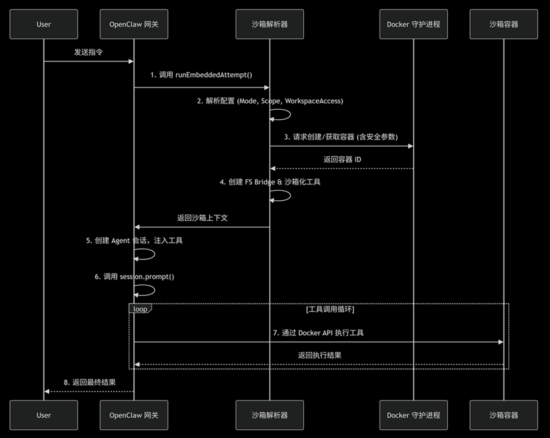

## OpenClaw 沙箱原理

OpenClaw的沙箱本质上是一个由Docker容器构成的隔离环境。它的核心设计是为了将AI Agent的工具操作限制在容器内容，从而显著降低因模型意外或恶意操作带来的安全风险。

整个沙箱环境的运行机制可以概括为：配置裁决 -> 环境准备 -> 工具桥接 -> 隔离执行

### 1. 何时启用：沙箱模式（mode）
首先，需要决定哪些会话需要使用沙箱。这是通过agents.defaults.sandbox.mode配置项控制的。
-   off:所有工作直接在本机上执行，不提供任何隔离    本地开发、调试、信任所有操作；
-   non-main:   仅对非主会话进行沙箱隔离，主会话在主机运行（通常是和机器人的聊天） 默认设置，在便利性和安全性之间取得平衡，因为群聊等场景风险更高。
-   all:    强制所有会话都在沙箱中执行。 对安全性要求极高的生产环境。

### 2 如何创建：沙箱后端与容器生命周期
当沙箱模式启动后，OpenClaw 就会开始创建和管理容器
-   后端（Backend）:默认且最常用的后端是Docker。它通过本地的Docker守护进程（如 /var/run/docket.sock）来管理容器。此外，也支持ssh和openssh等远程沙箱后端。
-   作用域（scope）：该配置决定了容器的复用策略，影响着资源的创建和销毁。
    -   session:   (默认)，每个会话创建一个独立容器，用完即销毁，隔离性最强；
    -   agent:  同一个agent的所有会话共享一个容器；
    -   shared: 所有沙箱会话共享一个容器，资源最省但隔离性最弱
-   创建与初始化（creation & seeding）：
    -   计算哈希：系统会根据镜像、环境变量、挂载点等所有配置计算一个哈希值；
    -   检查与复用：它会检查是否存在一个配置哈希相同且处于活动状态的容器。如果存在，则直接复用，以节省启动开销。
    -   创建或重建：如果没有可复用的容器，或配置已更改，则会销毁旧容器并创建一个新的；
    -   植入工作区（seeding）：容器首次创建时，OpenClaw会将本地工作区的内容植入到远程容器工作区一次。此后，所有文件操作都直接针对容器内的文件系统，更改不会自动同步回主机。
    -   安全加固：为了增强安全性，OpenClaw在创建容器时会应用一些列严格的Docker安全配置。

### 3 执行内容是如何放入沙箱：文件系统桥接与工具策略
准备好容器后，关键的一步是将Agent要执行的操作放入沙箱。
-   文件系统桥接（FS Bridge）：这是链接主机和容器文件系统的桥梁，它通过绑定挂载（binding mount）将主机上的特定目录映射到容器内部，挂载的权限由workspaceAccess控制：
    -   none: 不挂载，完全隔离；
    -   ro(read-only)：只读挂载，Agent可以查看文件但不能修改；
    -   rw(read-write):读写挂载，Agent拥有完整的文件读写权限；
-   工具沙箱化（Tool Sandboxing）：这是关键的一步，createOpenClawCodingTools()函数会根据沙箱状态，动态创建不同版本的工具
    -   沙箱启动时：它会生成sandboxedRead、sandboxedWrite、sandboxedExce等特殊工具，这些工具所有操作都通过Docker API在容器内执行，而不是直接调用主机的系统API。
    -   沙箱关闭时：则生成直接操作宿主机的原生工具版本
-   策略引擎（Tool Policy）：OpenClaw还有一个策略引擎，作为二道防线，它采用“白名单+层级过滤”机制，确保在沙箱内也只能执行被允许的操作。

### 4. 运行原理：从用户指令到隔离执行

